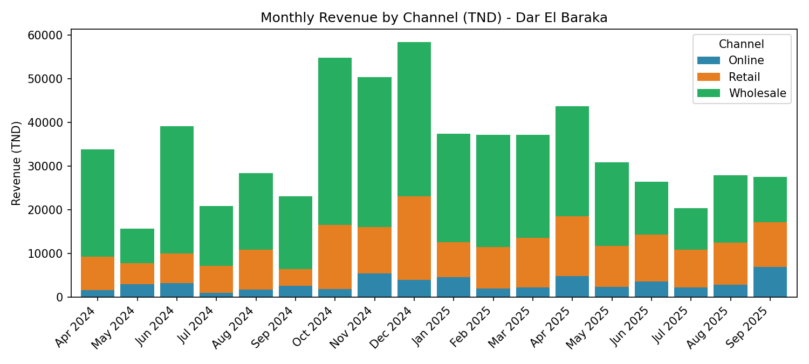

# Sales Dashboard — Dar El Baraka (Tunisian SME)

> ⚠️ **Portfolio case study — synthetic data, fictional company.**
> The dataset was generated by `analysis/generate_data.py`, so the
> "findings" below are *illustrative insights* demonstrating the analysis
> pipeline, not discoveries from real business data.

A complete, client-style data analysis case study: from messy raw orders to
an executive dashboard with business recommendations.



**Business:** *Dar El Baraka*, a fictional Tunis-based distributor of Tunisian
food products (olive oil, Deglet Nour dates, harissa, grains, honey) selling
through retail shops, wholesale partners and an online store.

## The Problem

The owner sees revenue growing but profit feels flat. Three questions:
1. Which channels and products actually make money?
2. Why did wholesale revenue fall off a cliff in 2025?
3. Where should they invest next — retail, wholesale recovery, or online?

## The Data

- `data/sales_data.csv` — 2,485 raw order lines (Apr 2024 → Sep 2025), with
  realistic messiness: **25 duplicate order IDs**, inconsistent region/channel
  casing, leading/trailing whitespace, **product-name typos**
  ("Harisa", "Huile d'Ol ive"), **~2% missing discounts**, ~1% missing regions,
  **mixed date formats** (YYYY-MM-DD and DD/MM/YYYY), **quantity outliers**
  (9999) and invalid negatives
- `data/sales_data_clean.csv` — cleaned dataset (2,452 rows, 1.3% removed)
- `data/monthly_summary.csv` — month-level aggregates

## Testing

`tests/test_pipeline.py` — 8 pytest checks, all passing:
- no duplicate order IDs after cleaning
- no missing values in critical columns
- quantities positive, outliers removed
- typos fixed, all dates parsed (both formats)
- revenue formula spot-checked on 5 rows
- monthly aggregates sum to the total revenue

## The Process

1. **Clean** (`analysis/sales_analysis.py`): fixed region casing, removed
   duplicate orders, validated quantities
2. **Analyze**: KPIs, month-over-month trends, channel / category / region splits,
   margin vs. discount analysis
3. **Visualize**: 4 charts in `visuals/`
4. **Deliver**: `dashboard/Sales_Dashboard.xlsx` — Cover, raw Data, KPI Dashboard
   with embedded charts, and Monthly breakdown

Run it yourself:
```bash
pip install -r requirements.txt
python analysis/generate_data.py   # regenerate the dataset
python analysis/sales_analysis.py  # cleaning + KPIs + charts
python analysis/build_excel.py     # build the Excel dashboard
```

## Assumptions (built into the data generator)

The synthetic data was generated with these baked-in assumptions — the
analysis below *recovers* them, which is the point of the exercise:
- **Cost ratios** per category (e.g. olive oil ~75% cost ratio → thin margins)
- **Discount patterns**: olive oil gets the deepest discounts (avg ~8%),
  other categories ~2%
- **Wholesale decline**: a scripted -51% drop in the last 4 months
- **Seasonality**: date sales spike in Q4 (harvest season)
- **Channel mix**: retail ~45%, wholesale ~35%, online ~20% (online growing)

## Illustrative Findings (on synthetic data)

| KPI | Value |
|---|---|
| Total revenue (18 months) | **613,848 TND** |
| Total profit | **201,152 TND** |
| Profit margin | **32.8%** |
| Orders | 2,460 · AOV **249.5 TND** |
| Revenue trend | **+9.9%** (first 6 months avg → last 6 months avg) |

**What the pipeline surfaces** (these mirror the generator's assumptions —
the value is in the *detection*, not the discovery):
- 🔴 **Wholesale collapsed**: from ~24,200 TND/month to ~11,900 TND/month
  (**-51%**) in the last 4 months — the single biggest risk to the business.
- 🫒 **Olive oil is a margin trap**: 42% of revenue but only **24.3% margin**,
  dragged down by the deepest discounts (avg **8.2%** vs ~2% elsewhere).
- 🟢 **Online is the growth engine**: smallest channel today, but the only one
  gaining share every quarter, with a healthy 32% margin.
- 📅 **Dates are seasonal**: Q4 (harvest) drives a massive spike — stock-outs
  in autumn mean leaving money on the table.

## Recommendations

1. **Recover wholesale immediately** — call the churned key accounts; ~12k
   TND/month is leaking.
2. **Cap olive-oil discounts at 5%** and replace deeper cuts with bundles
   (oil + harissa) to protect margin.
3. **Invest in online**: it converts growth into profit better than any channel.
4. **Plan Q4 inventory for dates** in August, not October.

## Tools

Python (pandas, matplotlib, openpyxl) · Excel · CSV
